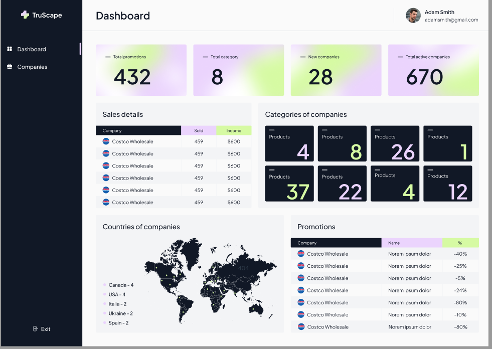
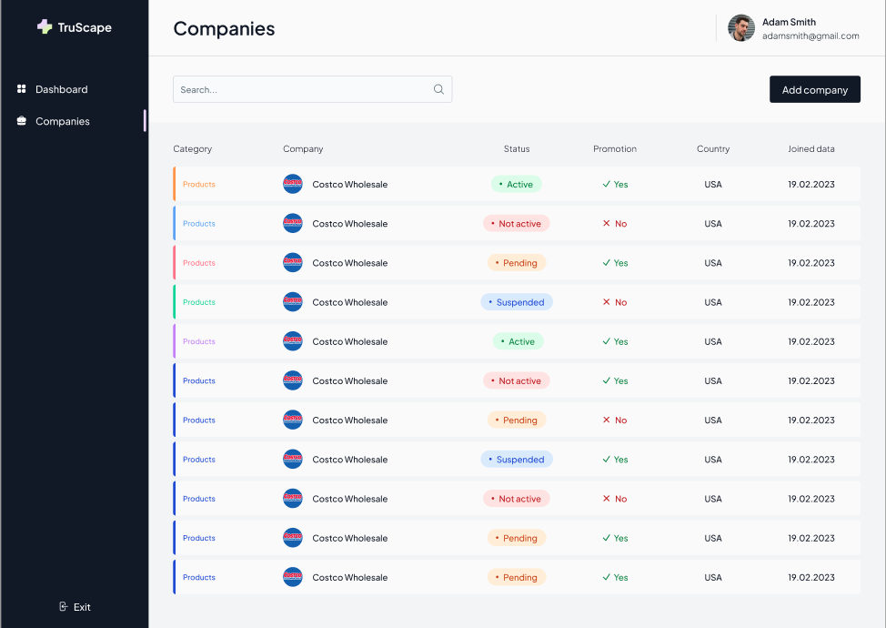
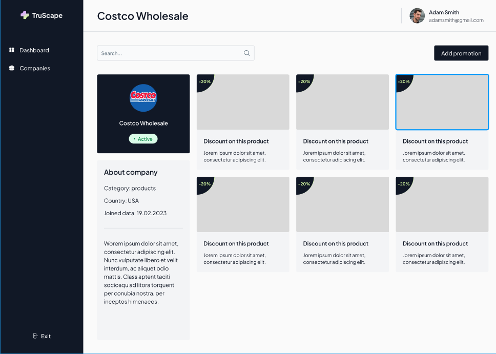
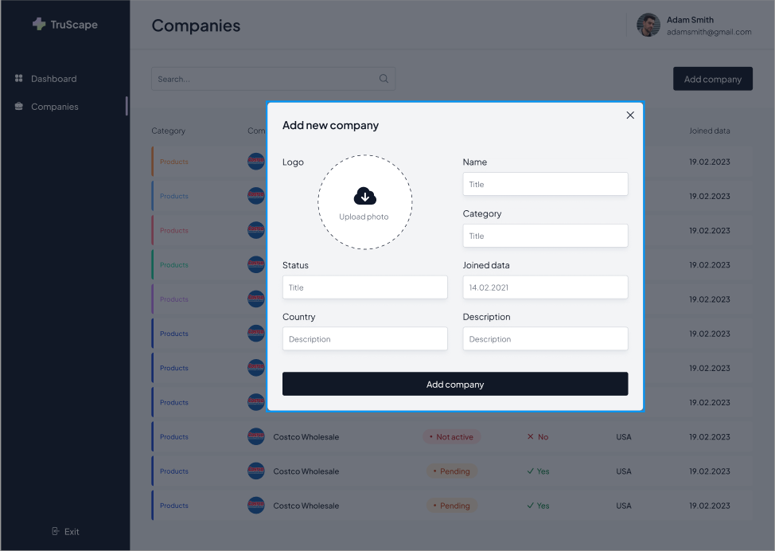
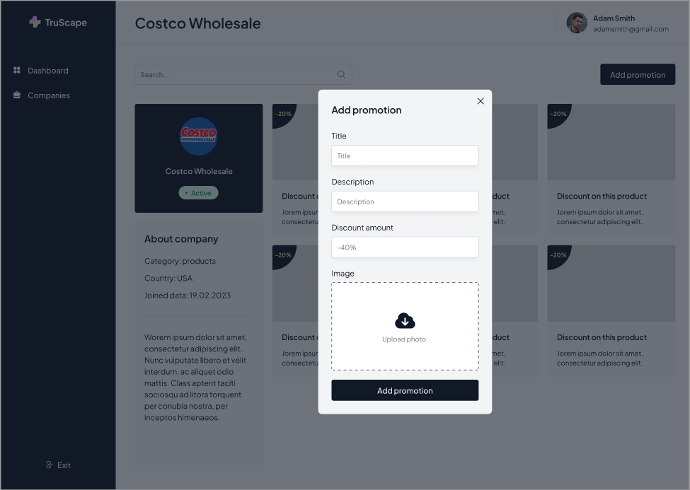

# TruScape CRM



TruScape CRM is a powerful Customer Relationship Management (CRM) system built with [Next.js](https://nextjs.org/). The application provides an intuitive interface for managing companies, their categories, promotions, and other data.

## 🚀 Features

- **Dashboard**:
  - Overall statistics of companies, categories, and promotions.
  - Sales breakdown and revenue visualization.
  - Geographical distribution of companies on a map.

- **Companies Page**:
  - Detailed information about each company: category, country, creation date.
  - List of promotions with the ability to add new ones.


## 🛠️ Technologies

- **Frontend**: [Next.js](https://nextjs.org/), [React](https://reactjs.org/)
- **UI**: CSS, Tailwind CSS
- **Tools**: ESLint, Prettier

## 📷 Screenshots

### Dashboard


### Companies


### Company Details


### Add New Company


### Add Promotion


## 📦 Installation and Launch

To run the project locally, follow these steps:

### 1. Clone the Repository
```bash
git clone https://github.com/gudzsv/crm.git
cd truescape-crm
```

### 2. Install Dependencies
Ensure you have Node.js (version 16 or higher) and npm or yarn installed.
```bash
npm install
# or
yarn install
```

### 3. Configure the Environment
Create a `.env.local` file in the root directory and add the required environment variables:
```
NEXT_PUBLIC_PROJECT_TOKEN=65c21c4ff7e6ea59682aa7e1
```

### 4. Run the Project
```bash
npm run dev
# or
yarn dev
```
The project will be available at: [http://localhost:3000](http://localhost:3000).

### 5. Build for Production
```bash
npm run build
npm start
```

